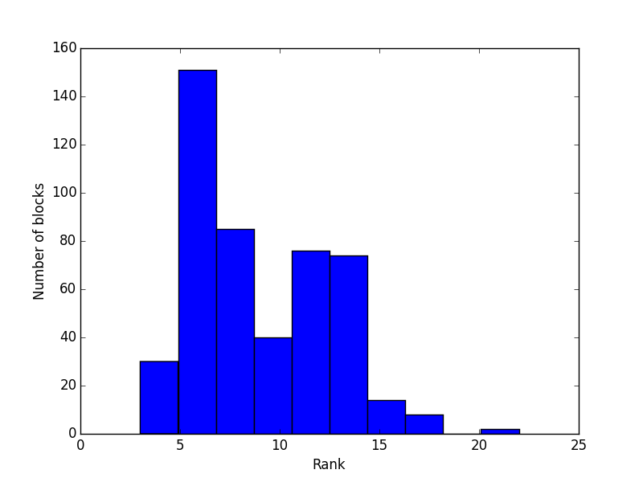

Fast assembly via Hierarchical matrices
=======================================

Assembling boundary integral operators is expensive since the matrices
are generally dense. Hence, if :math:`N` is the number of elements in
the grid the overall complexity of the assembly grows like :math:`O(N^3)`
and the cost of a matrix-vector product grows like :math:`O(N^2)`. This
makes large problems infeasible on standard hardware.

In recent years two techniques have been established to speed-up the
assembly of boundary integral operators: Fast Multipole Methods (FMM)
and Hierarchical Matrix (H-Matrix) techniques. BEM++ currently implements the
latter one. It brings down the cost of assembly and matrix-vector
products for integral operators to :math:`O(N\log N)`, making even
larger problems with hundred thousands of degrees of freedom possible
on a single workstation.

Introduction to hierarchical matrices
-------------------------------------
Hierarchical matrices are a complex topic. For a good introduction we refer
to the `MPI Lecture Notes on hierarchical matrices <http://www.mis.mpg.de/de/publications/andere-reihen/ln/lecturenote-2103.html>`_.
Another good resource is the recent `book on hierarchical matrices <http://www.springer.com/us/book/9783662473238>`_
by W. Hackbusch.

Using hierarchical matrix assembly
----------------------------------

Fast H-Matrix assembly of boundary and potential operators is enabled
by default in BEM++. The corresponding options are 
``bempp.api.global_parameters.assembly.boundary_operator_assembly_type``
and ``bempp.api.global_parameters.assembly.potential_operator_assembly_type``.
By default both are set to :math:`hmat`, which enables H-Matrix assembly.
For very small problems it is advisable to change the boundary operator
assembly type to `dense` as there is a larger overhead of `H-Matrix`
techniques for small problems.

A range of parameters controls the H-Matrix assembly itself. The most
important one is the accuracy parameter ``bempp.api.global_parameters.hmat.eps``.
This specifies the accuracy of the H-Matrix approximation, and by default is
set to :math:`1E-3`. The best value is problem dependent. In the following we
summarize all parameters that control the assembly. For very large problems
it is also advisable to inrease the value of ``bempp.api.global_parameters.hmat.max_block_size``.
As default it is set to :math:`2048`. This restricts the largest size an admissible matrix
block can have that will be low-rank approximated. Choosing a very large value can
have negative effect on the load-balancing between the different cores during assembly.
Choosing a too small value can lead to a significant increase in overall computational
complexity.

By default BEM++ uses a coarsening strategy to post-process the hierarchical matrix
assembly und further reduce the amount of memory an H-Matrix requires. This post-processing
is based an randomized low-rank approximations. In most of our experiments it increased
the assembly time by around 10% and often reduced the memory consumption by close to
50%. However, if it is not desired then the parameter 
``bempp.api.global_parameters.hmat.coarsening`` should be set to ``False``. The accuracy
of the coarsening strategy is by default the same as the assembly. Other values can be 
set by modifying ``bempp.api.global_parameters.hmat.coarsening_accuracy``.

Querying hierarchical matrices
------------------------------

Operators assembled via hierarchical matrices mostly behave in the same way as operators 
assembled using dense matrix techniques and the interface is identical. However, it is often
desirable to query advanced information from H-Matrices. This is implemented in the
module ``bempp.api.hmatrix_interface``.

Let us assemble a simple H-Matrix operator over a regular sphere.

::

    import bempp.api
    grid = bempp.api.regular_sphere(4)
    space = bempp.api.function_space(grid, "DP", 0)
    discrete_operator = bempp.operators.boundary.laplace.single_layer(
        space, space, space).weak_form()

Since H-Matrix assemble is automatically active we do not have to do anything else. We can now
collect some information on the H-Matrix.

To find out the memory consumption in kb we can use

::

    bempp.api.hmatrix_interface.mem_size(discrete_operator)

This will show the amount of storage that the H-Matrix data needs (not that it does not count
storage of administrational data such as the underlying tree structure).

The total number of blocks in the H-Matrix is given by

:: 

    bempp.api.hmatrix_interface.number_of_blocks(discrete_operator)

Similar commands exist for the number of dense blocks and the number of low-rank blocks.

BEM++ also gives access to the complete underlying tree structure. To obtain the block cluster
tree the command

::

    tree = bempp.api.hmatrix_interface.block_cluster_tree(discrete_operator)

can be used. To plot the tree call

::

    tree.plot()

This command requires that PyQt4 is installed.

An iterator over all leaf nodes of the tree is given by ``tree.leaf_nodes``. The root node
of the tree is obtained by

::

    root = tree.root

From the root node the tree can be traversed hierarchically. The children of a node are
available through an iterator. Hence, to iterate through the four children of root
use

::

    for child in root.children:
        print((child.row_cluster_range, child.column_cluster_range))

This prints out the ranges of the four subnodes of ``root``. Subnodes are traversed
in C-style order. Hence, if at the first level the H-Matrix has the form

.. math::

    A = \begin{bmatrix} A_{11} & A_{12}\\ A_{21} & A_{22} \end{bmatrix}

the ``children`` iterator returns the nodes in the order :math:`A_{11}`, :math:`A_{12}`, 
:math:`A_{21}`, :math:`A_{22}`.

To get from the leafs of the block cluster tree to the data associated with the leafs the function
``bempp.api.hmatrix_interface.data_block`` can be used.

For example, the following code makes a histogram plot of the ranks of the data for all admissible
nodes in the above created H-Matrix.

::

    import matplotlib.pyplot as plot
    admissible_nodes = [node for node in tree.leaf_nodes if node.admissible]
    ranks = [bempp.api.hmatrix_interface.data_block(discrete_operator, node).rank \
        for node in admissible_nodes]
    plt.hist(ranks)
    plt.xlabel('Rank')
    plt.ylabel('Number of blocks')
    plt.show()

The result looks as follows.

Most low-rank data blocks are compressed down to a rank of around six.

Function and class reference
----------------------------
.. autoclass:: bempp.core.hmat.block_cluster_tree.BlockClusterTree
    :members:
.. autoclass:: bempp.core.hmat.block_cluster_tree.BlockClusterTreeNode
    :members:
.. autoclass:: bempp.core.hmat.hmatrix_data.HMatrixDataBase
    :members:
.. autoclass:: bempp.core.hmat.hmatrix_data.HMatrixLowRankData
    :members:
.. autoclass:: bempp.core.hmat.hmatrix_data.HMatrixDenseData
    :members:
.. autofunction:: bempp.api.hmat.hmatrix_interface.number_of_blocks
.. autofunction:: bempp.api.hmat.hmatrix_interface.number_of_dense_blocks
.. autofunction:: bempp.api.hmat.hmatrix_interface.number_of_low_rank_blocks
.. autofunction:: bempp.api.hmat.hmatrix_interface.mem_size
.. autofunction:: bempp.api.hmat.hmatrix_interface.block_cluster_tree
.. autofunction:: bempp.api.hmat.hmatrix_interface.data_block

