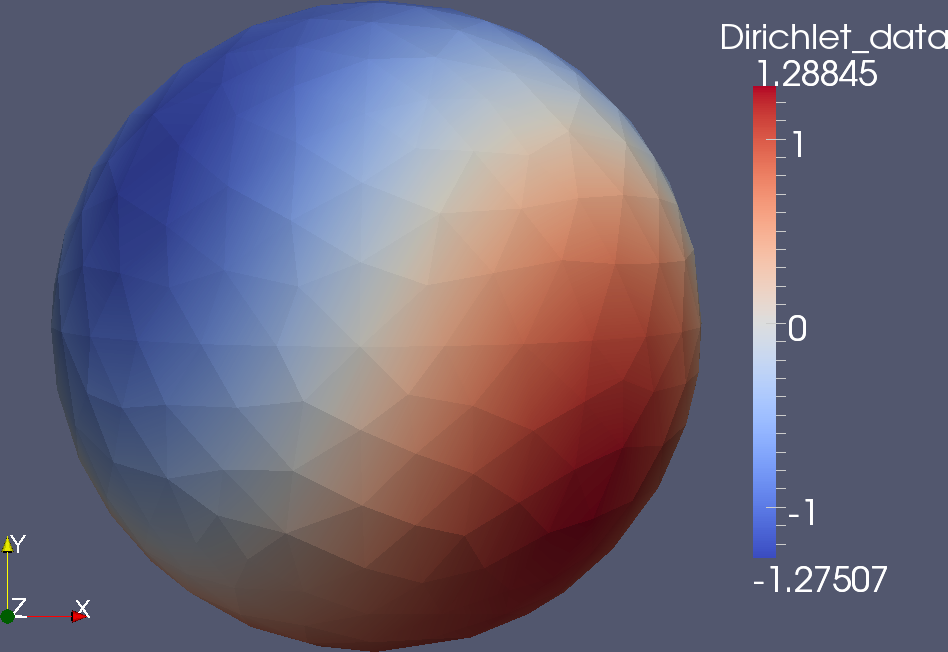
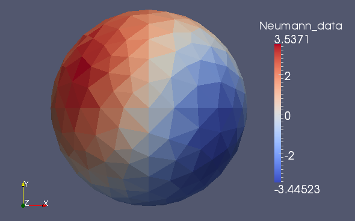

.. highlight:: none

Exterior Dirichlet problem for the Laplace equation
===================================================

Mathematical background
-----------------------

In this tutorial we are going to use BEM++ to solve the Laplace
equation in the domain exterior to a unit sphere :math:`\Omega`. The
function :math:`u` is supposed to satisfy Dirichlet boundary
conditions on the surface of the sphere, :math:`\Gamma \equiv \partial
\Omega`, and decay to zero at infinity. Mathematically, this problem
can be written as

.. math:: 

    \Delta u = 0 \quad \text{in} \quad \Omega^{\text{c}},
    \qquad \gamma_0^{\text{ext}}u = g, 
    \qquad \lvert u(x) \rvert = \mathcal O(\lvert x \rvert^{-1}) 
    \quad \text{as} \quad \lvert x \rvert \to \infty,

where :math:`\Omega^{\text{c}} \equiv \mathbb{R}^3 \setminus \Omega`
is the exterior domain, :math:`\gamma_0^{\text{ext}}` denotes the
exterior Dirichlet trace of :math:`u` on :math:`\Gamma`
and :math:`g` is a known function. According to the Green's
representation formula, the value of :math:`u` at any point in
:math:`\Omega^{\text{c}}` is fully determined by its exterior
Dirichlet and Neumann traces on :math:`\Gamma`,
:math:`\gamma_0^{\text{ext}}` and :math:`\gamma_1^{\text{ext}}`:

.. math::     
    u(x) = -\hat V \gamma_1^{\text{ext}} + \hat K
    \gamma_0^{\text{ext}}
    \qquad \forall x \in \Omega^{\text{c}},
    :label: green

where :math:`\hat V : H^{-\frac{1}{2}}(\Gamma) \rightarrow
H^1(\Omega^{\text{c}})` and :math:`\hat K:H^{\frac{1}{2}}(\Gamma)
\rightarrow H^1(\Omega^{\text{c}})` denote the single- and
double-layer potential operators associated with the fundamental
solution of the Laplace operator. Thus, to be able to evaluate
:math:`u` at any point in :math:`\Omega^{\text{c}}`, we only need to
find the missing Neumann trace.

The Dirichlet and Neumann traces of a function satisfying the Laplace
equation in an exterior domain with smooth boundary are linked by the
following relation:

.. math::
    V \gamma_1^{\text{ext}} u = 
    \bigg({-\frac{1}{2}} I + K\bigg) \gamma_0^{\text{ext}} u.
    :label: steklov
    
Here, 

.. math::

    V:H^{-\frac{1}{2}}(\Gamma) \rightarrow H^{\frac{1}{2}}(\Gamma)
    
    K:H^{\frac{1}{2}}(\Gamma) \rightarrow H^{\frac{1}{2}}(\Gamma)

are the single- and double-layer-potential *boundary operators*
associated with the fundamental solution of the Laplace operator and
:math:`I` is the identity operator. (Note the difference between
e.g. :math:`\hat K` and :math:`K`: applied to a member of
:math:`H^{\frac{1}{2}}(\Gamma)`, the former operator produces a
function defined in the whole exterior domain, while the latter
produces a function defined only on the boundary :math:`\Gamma`.)
Equation :eq:`steklov` is the boundary integral equation that we will
aim to solve for the Neumann trace :math:`\gamma_1^{\text{ext}}` using
the boundary element method.

To this end, we first select function spaces :math:`S^0 \subset
H^{-\frac{1}{2}}(\Gamma)` and :math:`S^1 \subset
H^{\frac{1}{2}}(\Gamma)` with bases :math:`\{\phi^0_i\}_{i=1}^{n_0}`
and :math:`\{\phi^1_i\}_{i=1}^{n_1}`, respectively. We expand the
known Dirichlet data in the basis of :math:`S^0`,

.. math:: 

    \gamma_0^{\text{ext}}u = g = \sum_i g_i \phi^0_i,

and we seek in :math:`S^1` such an approximation to the Neumann data, 

.. math:: 

    \gamma_1^{\text{ext}}u \approx b = \sum_i b_i \phi^1_i,

that :eq:`steklov` is satisfied weakly, i.e.

.. math:: 
    
    \sum_i g_i (V \phi^0_i, \phi^0_j) = 
    \sum_i b_i \bigg(\bigg(-\frac{1}{2} I + K\bigg)\phi^1_i,
    \phi^0_j\bigg) 
    \qquad \forall j. 

Note that the :math:`H^{-\frac{1}{2}}(\Gamma)`-ellipticity of
:math:`V` means that the problem is well-posed.  

We will now present the C++ and Python versions of a program using
BEM++ to solve :eq:`steklov` for the Neumann trace and, subsequently,
the Green's representation formula :eq:`green` to evaluate the field
:math:`u` on a cross-section of the exterior domain :math:`\Omega^{\text{c}}`.

Implementation in C++
---------------------

A complete listing of the code developed in this section can be found in
``examples/tutorial_dirichlet.cpp``.

We begin by loading a triangular mesh approximating the surface
:math:`\Gamma` from a file in the `Gmsh <http://geuz.org/gmsh>`_ format::

    #include "grid/grid_factory.hpp"

    ...

    using namespace Bempp;
   
    const char* meshFile = "meshes/sphere-644.msh";
    GridParameters params;
    params.topology = GridParameters::TRIANGULAR;
    std::auto_ptr<Grid> grid = GridFactory::importGmshGrid(params, meshFile);
   
Now we can define the approximation spaces.  For this example, we
will use the space of piecewise-linear scalar functions for
:math:`S^1` and the space of piecewice-constant scalar functions for
:math:`S^0`::

    #include "space/piecewise_linear_continuous_scalar_space.hpp"
    #include "space/piecewise_constant_scalar_space.hpp"
   
    typedef BFT double;

    ...
   
    PiecewiseLinearContinuousScalarSpace<BFT> S0(*grid);
    PiecewiseConstantScalarSpace<BFT> S1(*grid);
   
    S1.assignDofs();
    S0.assignDofs();

The space classes are templated on the type used to represent values
of their basis functions. It can be set to ``float``, ``double``,
``std::complex<float>`` or ``std::complex<double>``. It is convenient
to introduce a typedef to refer to the chosen basis function type,
like we did in the above snippet (``BFT``). The constructors of space
objects take a single argument -- a reference to the ``Grid`` on whose
elements live individual basis functions. The calls to ``assignDofs()``
initialise the spaces, performing the mapping of local to global
degrees of freedom.

We would like now to construct the necessary boundary operators.
Before we do that, however, we need to define a ``Context`` object,
which controls the procedure used to discretise "abstract"
mathematical operators. The constructor of the ``Context`` class looks
as follows::

    Context(const shared_ptr<QuadratureStrategy>& quadStrategy,
            const AssemblyOptions& assemblyOptions);

The ``QuadratureStrategy`` interface determines how individual
integrals occurring in the weak forms of operators are
calculated. Currently BEM++ only supports numerical
quadrature. Therefore we construct a ``NumericalQuadratureStrategy``
object::

    #include "assembly/numerical_quadrature_strategy.hpp"
    typedef RT double;
    ...
    NumericalQuadratureStrategy<BFT, RT> quadStrategy;

The ``NumericalQuadratureStrategy`` class takes two template
arguments: the first is the already known basis function type, and the
second, called *result type*, is the type used to represent the values
of the integrals. Obviously, in problems involving complex-valued
operators, like those related to the Helmholtz equation, the result
type needs to be chosen as ``std::complex<float>`` or
``std::complex<double>``. The constructor of
``NumericalQuadratureStrategy`` takes an optional parameter that can
be used to fine-tune the quadrature accuracy.

The ``AssemblyOptions`` object controls higher-level aspects of the
weak-form assembly. Most importantly, it determines whether the
adaptive cross approximation algorithm is used to accelerate the
assembly and to reduce the memory consumption. ``AssemblyOptions`` can
also be used to switch between serial and parallel assembly. To turn
on ACA (which is off by default), we write::

    #include "assembly/assembly_options.hpp"
    ...
    AssemblyOptions assemblyOptions;
    AcaOptions acaOptions; // Default parameters for ACA
    assemblyOptions.switchToAca(acaOptions);

Having defined the quadrature strategy and assembly options, we
construct the ``Context``::

    #include "assembly/context.hpp"
    #include "common/boost_make_shared_fwd.hpp"
    ...
    Context<BFT, RT> context(make_shared_from_ref(quadStrategy), assemblyOptions);

The ``make_shared_from_ref()`` convenience function constructs a shared
pointer to an argument allocated on the stack.

We are now ready to create the individual operators. Looking at
equation :eq:`steklov`, we see that we need the single-layer and
double-layer potential boundary operators for the 3D Laplace equation
and the identity operator::

    #include "assembly/identity_operator.hpp"
    #include "assembly/laplace_3d_single_layer_boundary_operator.hpp"
    #include "assembly/laplace_3d_double_layer_boundary_operator.hpp"
    ...
    BoundaryOperator<BFT, RT> slpOp =
            laplace3dSingleLayerBoundaryOperator<BFT, RT>(
                make_shared_from_ref(context),
                make_shared_from_ref(HminusHalfSpace),
                make_shared_from_ref(HplusHalfSpace),
                make_shared_from_ref(HminusHalfSpace));
    BoundaryOperator<BFT, RT> dlpOp =
            laplace3dDoubleLayerBoundaryOperator<BFT, RT>(
                make_shared_from_ref(context),
                make_shared_from_ref(HplusHalfSpace),
                make_shared_from_ref(HplusHalfSpace),
                make_shared_from_ref(HminusHalfSpace));
    BoundaryOperator<BFT, RT> id =
            identityOperator<BFT, RT>(
                make_shared_from_ref(context),
                make_shared_from_ref(HplusHalfSpace),
                make_shared_from_ref(HplusHalfSpace),
                make_shared_from_ref(HminusHalfSpace));

To explain this snippet, we need to give some background on the
representation of operators in BEM++.

BEM++ distinguishes between two types of boundary
operators. Representations of "abstract" (non-discretised)
mathematical operators implement the ``AbstractBoundaryOperator``
interface. An abstract boundary operator is characterised by its
domain (the space of functions on which it acts), its range (the space
of functions produced by the operator acting on functions from its
domain), and the space dual to its range (used to construct its weak
form). A call to the ``AbstractBoundaryOperator::assembleWeakForm()``
virtual function builds a discrete weak form of the operator, which is
represented by an object implementing the ``DiscreteBoundaryOperator``
interface.

Users of BEM++ do not usually need to interact directly with abstract
and discretised boundary operators. Instead, they construct
``BoundaryOperator`` objects that act as thin wrappers of a pair of
shared pointers to a particular abstract operator and its weak
form. The latter is built on demand on the first call to
``BoundaryOperator::weakForm()``, using the settings obtained from the
``Context`` object passed to the constructor of
``BoundaryOperator``. The ``BoundaryOperator`` class does not contain
any virtual functions and its instances can be safely copied or passed
by value.

In principle, a ``BoundaryOperator`` can be created by first
constructing the appropriate ``AbstractBoundaryOperator`` object and
then passing it along with a ``Context`` object to the constructor of
the ``BoundaryOperator`` class. For convenience, however, each
concrete subclass of ``AbstractBoundaryOperator`` in BEM++ provides a
"non-member constructor" that returns a ready-made
``BoundaryOperator`` object. The
``laplace3dSingleLayerBoundaryOperator``,
``laplace3dDoubleLayerBoundaryOperator`` and ``identityOperator``
functions shown in the above snippet are examples of such non-member
constructors and all three of them take the same set of arguments as
the function below::

    template <typename BasisFunctionType, typename ResultType>
    BoundaryOperator<BasisFunctionType, ResultType>
    laplace3dSingleLayerBoundaryOperator(
            const shared_ptr<const Context<BasisFunctionType, ResultType> >& context,
            const shared_ptr<const Space<BasisFunctionType> >& domain,
            const shared_ptr<const Space<BasisFunctionType> >& range,
            const shared_ptr<const Space<BasisFunctionType> >& dualToRange,
            const std::string& label = "");

The last argument is an optional string that can be used to label
operators for debugging purposes.

Forming the operator sum :math:`-\frac{1}{2} I + K` occurring on the
right of equation :eq:`steklov` is as simple as ::

    BoundaryOperator<BFT, RT> rhsOp = -0.5 * id + dlpOp;

We now need an object representing the known Dirichlet trace
:math:`\gamma_0^{\text{ext}}`. We will first declare a functor class
providing an ``evaluate()`` function computing the value of this trace
at a given point, together with some additional functions and
typedefs::

    typedef double CT; // coordinate type

    class DirichletData
    {
    public:
        // Type representing the function's values
        typedef RT ValueType;
        // Type representing coordinates (must be the "real part" of ValueType)
        typedef CT CoordinateType;

        // Number of components of the function's argument
        int argumentDimension() const { return 3; }
        // Number of components of the function's value
        int resultDimension() const { return 1; }

        // Evaluate the function at the point "point" and store result in
        // the array "result"
        inline void evaluate(const arma::Col<CoordinateType>& point,
                             arma::Col<ValueType>& result) const {
            CoordinateType x = point(0), y = point(1), z = point(2);
            // Euclidean norm of the vector "point"
            CoordinateType r = arma::norm(point, 2);
            result(0) = 2 * x * z / (r * r * r * r * r) - y / (r * r * r);
        }
    };

BEM++ uses the `Armadillo <http://arma.sourceforge.net>`_ library to
handle multidimensional arrays. ``arma::Col<T>`` is the Armadillo
class template representing a column vector. As illustrated above, the
vector elements are indexed from zero and can be accessed with the
overloaded function call operator. The Dirichlet data we have taken
correspond to the function

.. math:: 
    u_{\text{exact}} = \frac{2xz}{r^5} - \frac{y}{r^3}, 
    \qquad \text{where} \qquad r \equiv \sqrt{x^2 + y^2 + z^2},
    :label: exact-solution

which is an exact solution of the Laplace equation away from the point
:math:`x = y = z = 0` and decays to zero at infinity. The plot of this function on the chosen spherical mesh is shown in the figure below.

An instance of ``DirichletData`` as defined above can be used to
create a ``GridFunction`` object representing a function defined on a
surface mesh and expanded in a particular function space
:math:`S`. The ``GridFunction`` class has several constructors, one of
which can be used to discretise a function :math:`f` given by an
analytical formula. Its coefficients :math:`f_i` in the basis
:math:`\{\phi_i, i = 1\dots n\}` of :math:`S` are obtained by
projecting the equation :math:`f = \sum_i f_i \phi_i` on the basis
functions :math:`\{\psi_j, j = 1\dots m\}` of a *dual space* :math:`T`
and solving the resulting system

.. math::

    f_i (\phi_i, \psi_j) = (f, \psi_j) \qquad \forall j

(potentially in the least-square sense, if :math:`S \neq T`). The
constructor in question is ::

    GridFunction(const shared_ptr<const Context<BasisFunctionType, ResultType> >& context,
                 const shared_ptr<const Space<BasisFunctionType> >& space,
                 const shared_ptr<const Space<BasisFunctionType> >& dualSpace,
                 const Function<ResultType>& function);

with ``space`` denoting the expansion space :math:`S`, ``dualSpace``
the dual space :math:`T`, ``context`` being a ``Context`` object
determining the way the integrals :math:`(\psi_j, \phi_i)` and
:math:`(\psi_j, f)` are calculated, and ``function`` standing for a
``Function`` object wrapping a user-defined functor. A ``Function``
object can be obtained using one of the functions ::

    template <typename Functor>
    SurfaceNormalDependentFunction<Functor> surfaceNormalDependentFunction(
        const Functor& functor);
    template <typename Functor>
    SurfaceNormalIndependentFunction<Functor> surfaceNormalIndependentFunction(
        const Functor& functor);

Each of these takes a ``Functor`` object that is supposed to provide
the member functions and types present in the ``DirichletData`` class
declared above; the only difference is that the ``evaluate`` method of
a functor passed to ``surfaceNormalDependentFunction()`` should take
an additional input parameter representing the unit vector normal to
the surface at a given point.

In our present program, we will use
``surfaceNormalIndependentFunction()`` and construct the
``GridFunction`` representing the Dirichlet trace as follows::

    #include "assembly/grid_function.hpp"
    #include "assembly/surface_normal_independent_function.hpp"
    ...
    GridFunction<BFT, RT> dirichletData(
                make_shared_from_ref(context),
                make_shared_from_ref(HplusHalfSpace),
                make_shared_from_ref(HplusHalfSpace),
                surfaceNormalIndependentFunction(DirichletData()));

To obtain the object representing the function standing on the
right-hand side of eq. :eq:`steklov`, it suffices to use the
overloaded multiplication operator, which in this context yields the
result of applying the operator ``rhsOp`` to the function
``dirichletData``::

    GridFunction<BFT, RT> rhs = rhsOp * dirichletData;

Having constructed both the left-hand-side operator (``slpOp``) and
the right-hand-side function (``rhs``), we are now ready to solve the
integral equation. BEM++ provides wrappers of the dense linear solver
from LAPACK and the pseudo-block GMRES iterative solver from
Trilinos. We will use the latter solver::

    #include "linalg/default_iterative_solver.hpp"
    #include <iostream>
    ...
    DefaultIterativeSolver<BFT, RT> solver(slpOp);
    // 1e-5 -- convergence tolerance
    solver.initializeSolver(defaultGmresParameterList(1e-5));
    Solution<BFT, RT> solution = solver.solve(rhs);
    std::cout << solution.solverMessage() << std::endl;

Assuming that the solver converged -- which can be verified by reading
the solver message printed to the screen or by checking the
``solution.status()`` flag -- the solution is now ready for
postprocessing. We can, for example, export the Neumann trace to a VTK
file::

    const GridFunction<BFT, RT>& solFun = solution.gridFunction();
    solFun.exportToVtk(VtkWriter::CELL_DATA, "Neumann_data", "solution");

In VTK, data can be treated either as cell data (using
piecewise-constant interpolation of values at element barycentres) or
vertex data (using piecewise-linear interpolation of values at element
vertices). This is determined with the first parameter of the
``exportToVtk()`` function. The second parameter is the label of the
data series, to be stored inside the VTK file, and the third parameter
is the VTK file name (without extension -- the ``.vtu`` extension is
added automatically).

The numerical solution obtained in this way is shown in the figure below.

Since we know the analytical solution :eq:`exact-solution` to the
posed Dirichlet problem, we can calculate the exact Neumann trace of
:math:`u` and evaluate the relative :math:`L^2(\Gamma)` error of the
numerical solution::

    class ExactNeumannData
    {
    public:
        typedef RT ValueType;
        typedef CT CoordinateType;

        int argumentDimension() const { return 3; }
        int resultDimension() const { return 1; }

        inline void evaluate(const arma::Col<CoordinateType>& point,
                             arma::Col<ValueType>& result) const {
            CoordinateType x = point(0), y = point(1), z = point(2);
            CoordinateType r = arma::norm(point, 2);
            result(0) = -6 * x * z / (r * r * r * r * r * r) + 2 * y / (r * r * r * r);
        }
    };

    ...

    GridFunction<BFT, RT> exactSolFun(
                make_shared_from_ref(context),
                make_shared_from_ref(HminusHalfSpace),
                make_shared_from_ref(HminusHalfSpace),
                surfaceNormalIndependentFunction(ExactNeumannData()));
    GridFunction<BFT, RT> diff = solFun - exactSolFun;
    std::cout << "Relative L^2 error: "
              << diff.L2Norm() / exactSolFun.L2Norm() << std::endl;

For the 644-element mesh used in the example this relative error turns
out to be 3.6%.

TODO: write the part on evaluating :math:`u` inside :math:`\Omega^{\text{c}}`.

